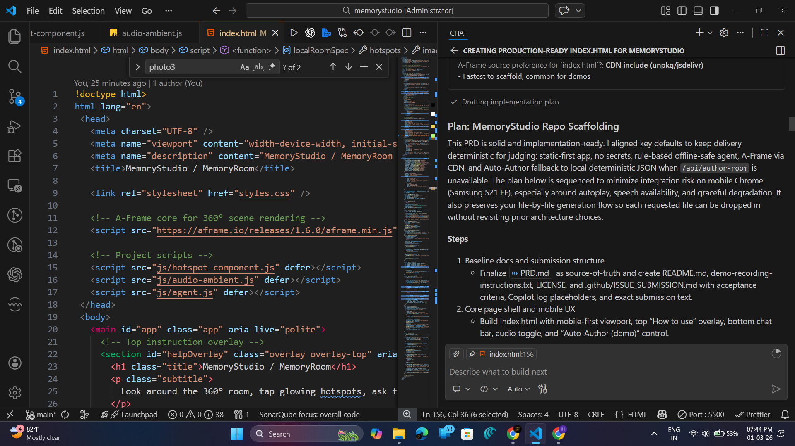
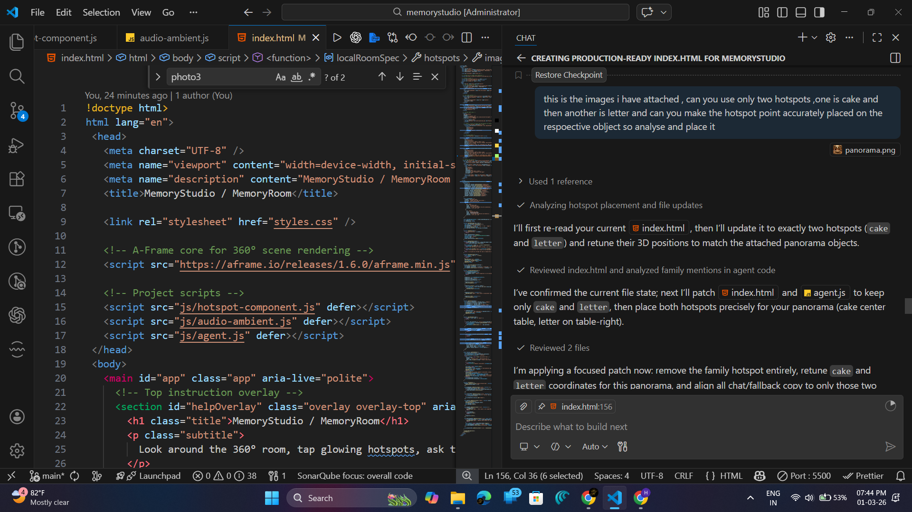
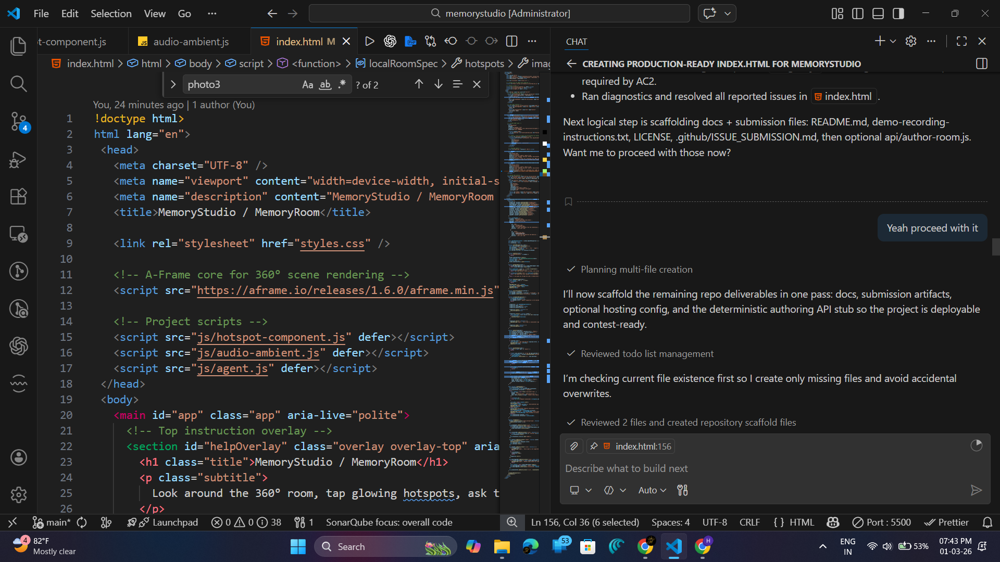

# MemoryStudio — Agent-Guided 360° WebXR Experience


*An immersive 360° WebXR memory room built using GitHub Copilot*

---

## 1. Project Title and Banner

MemoryStudio is a creative, agent-guided WebXR experience designed for immersive storytelling in a 360° memory room.

---

## 2. Demo Preview

- **Demo Video:** https://youtube.com/shorts/yqQKQ9VEwCA  
- **Screenshots:** https://github.com/HarishKumar-005/memorystudio/tree/main/screenshots  
- **Live Demo:** https://memorystudio-ar.vercel.app

---

## 3. Project Overview

MemoryStudio is a browser-based 360° WebXR application where users can explore a memory room, interact with key objects, and receive context-aware narration from an on-device agent via text and voice.

### What the project is
- A mobile-first immersive memory experience built with A-Frame.
- A deterministic, rule-based agent system for reliable behavior during demos.

### What problem it solves
- Many XR demos depend on external APIs and unstable network calls.
- Contest demos can fail when keys, model endpoints, or latency issues occur.

### Why it is useful
- Delivers a stable, low-friction interactive experience for judges and users.
- Works without API keys and is designed for consistent behavior.

### How it demonstrates GitHub Copilot usage
- Copilot was used to scaffold UI structure, interaction logic, and modular JavaScript components.
- Copilot accelerated iterative refinement of hotspots, speech handling, and serverless stubs.

---

## 4. Features

- 360° immersive WebXR environment
- Interactive memory hotspots
- Voice and text AI agent
- Offline-safe architecture
- Procedural ambient audio
- Auto-Author feature

---

## 5. GitHub Copilot Usage

GitHub Copilot was used throughout development as a productivity and implementation assistant.

### How Copilot was used during development
- Generated initial scene structure and UI overlays.
- Suggested event wiring for hotspot interactions and card rendering.
- Helped draft fallback-safe speech and chat flow logic.
- Assisted with deterministic serverless endpoint scaffolding.

### How Copilot helped generate components
- A-Frame scene composition blocks
- Hotspot behavior integration
- Agent response scaffolding
- Client-side UI state wiring

### How Copilot improved productivity
- Reduced boilerplate coding time for repeated patterns.
- Accelerated prototyping and refinement cycles.
- Improved implementation speed while keeping modular code structure.

### Copilot screenshots






---

## 6. Technology Stack

- GitHub Copilot
- A-Frame WebXR
- JavaScript
- HTML5 / CSS3
- Web Speech API
- Web Audio API
- Vercel Serverless Functions

---

## 7. Project Structure

```text
index.html
styles.css
js/
assets/
api/
screenshots/
```

---

## 8. Setup Instructions

```bash
git clone <repo-url>
cd <repo-folder>
npx http-server .
```

Open the local URL shown in terminal (commonly `http://127.0.0.1:8080`).

- No environment variables required.
- No API keys required.

---

## 9. How to Use

1. Enter the room by clicking **Play Demo**.
2. Click/tap hotspots to view memory cards.
3. Use chat to ask about the memory objects.
4. Use voice input where browser support is available.
5. Use **Auto-Author (demo)** to load deterministic room JSON.

---

## 10. Technical Architecture

- **A-Frame rendering:** panorama and interactive entities rendered in a 360° scene.
- **Rule-based agent:** deterministic local intent matching for stable responses.
- **Speech system:** Web Speech API (input) + Speech Synthesis (output).
- **Asset loading:** static assets served from `assets/` with no external secret dependencies.

---

## 11. Screenshots Section




---

## 12. Submission Information

- Microsoft Agents League 2026
- Creative Apps Track
- Built using GitHub Copilot

---

## 13. License

MIT License

---

## 14. Author Section

- **Harish Kumar S P** — GitHub: `@HarishKumar-005`
- **Akshaya S** — GitHub: `@akshaya12406-byte`


